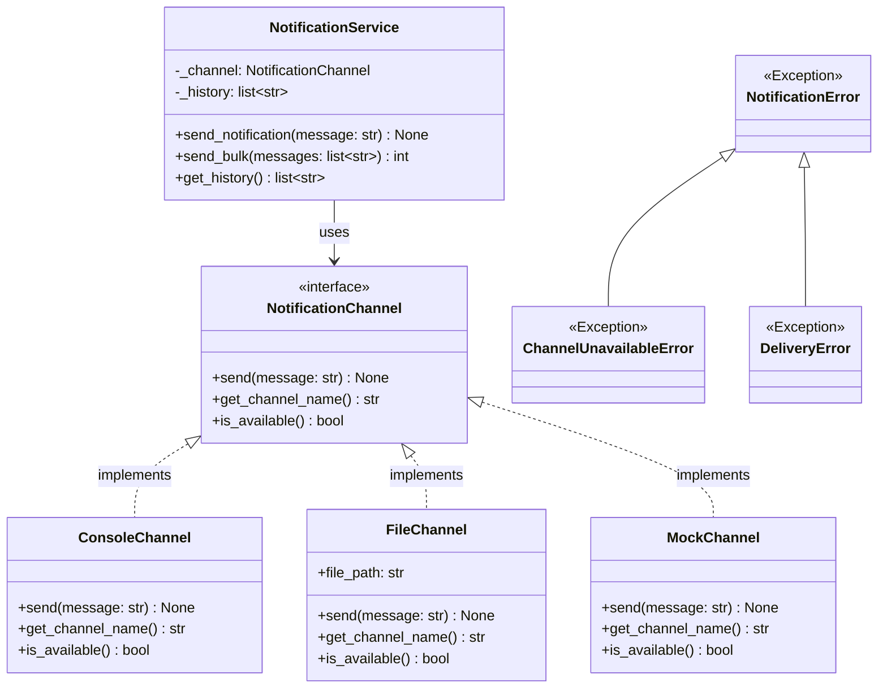

# Ejercicio NotificationService

Para este ejercicio debes implementar un sistema de notificaciones orientado a objetos que permita enviar
mensajes a través de distintos canales. El sistema debe abstraer el medio de entrega, manejar errores
mediante excepciones específicas y operar de forma polimórfica con cualquier canal que implemente la
interfaz definida.

## Diagrama de Clases



Tu tarea es implementar el diseño que se muestra en el diagrama anterior. Todas las clases se deben
definir en el módulo `app/model/notification.py`. Para ello, debes tener en cuenta las siguientes
instrucciones:

---

## Parte 1: Implementación del Modelo

### 1. Excepciones personalizadas

Crea una jerarquía de excepciones para capturar y distinguir los distintos errores del sistema:

- **`NotificationError`**: excepción base para todos los errores relacionados con las notificaciones.
  Debe heredar de `Exception`.
- **`ChannelUnavailableError`**: se lanza cuando el canal no está disponible
  (`is_available()` devuelve `False`). Debe heredar de `NotificationError`.
- **`DeliveryError`**: se lanza cuando ocurre un error inesperado durante el envío del mensaje
  (por ejemplo, fallo al escribir en disco). Debe heredar de `NotificationError`.

Estas excepciones deben usarse dentro de las implementaciones de la abstracción y en `NotificationService`.

### 2. Abstracción `NotificationChannel`

Define la abstracción `NotificationChannel` que modele cualquier canal de notificación. Puedes
implementarla de **dos maneras equivalentes**; elige la que prefieras y justifica tu elección:

#### Opción A — Protocolo (`typing.Protocol`)

```python
from typing import Protocol, runtime_checkable

@runtime_checkable
class NotificationChannel(Protocol):
    def send(self, message: str) -> None: ...
    def get_channel_name(self) -> str: ...
    def is_available(self) -> bool: ...
```

Con esta opción las clases que implementen el canal **no necesitan heredar** explícitamente de
`NotificationChannel`; basta con que definan los tres métodos requeridos (*tipado estructural* o
*duck typing*). El decorador `@runtime_checkable` permite verificar en tiempo de ejecución si un
objeto satisface el protocolo usando `isinstance()`.

#### Opción B — Clase abstracta (`abc.ABC`)

```python
from abc import ABC, abstractmethod

class NotificationChannel(ABC):
    @abstractmethod
    def send(self, message: str) -> None: ...

    @abstractmethod
    def get_channel_name(self) -> str: ...

    @abstractmethod
    def is_available(self) -> bool: ...
```

Con esta opción las clases que implementen el canal **deben heredar** explícitamente de
`NotificationChannel` y sobreescribir los tres métodos abstractos (*tipado nominal*). Python lanzará
`TypeError` al intentar instanciar una subclase que no haya implementado todos los métodos.

---

Independientemente de la opción elegida, `NotificationChannel` debe exponer los tres métodos
siguientes:

- `send(message: str) -> None`: envía un mensaje a través del canal.
  - Debe lanzar `ChannelUnavailableError` si `is_available()` devuelve `False`.
  - Debe lanzar `DeliveryError` si ocurre un error inesperado durante el envío.
- `get_channel_name() -> str`: retorna un identificador descriptivo del canal.
- `is_available() -> bool`: retorna `True` si el canal está listo para recibir mensajes.

### 3. Implementaciones de la abstracción

Crea tres clases que implementen la abstracción `NotificationChannel`:

#### `ConsoleChannel`

- Canal que envía mensajes imprimiéndolos en la salida estándar.
- La clase **no** debe implementarse como una `dataclass`.
- `is_available()` siempre retorna `True` (no requiere recurso externo).
- `get_channel_name()` retorna la cadena `"console"`.
- `send(message)` imprime el mensaje en la consola. Si ocurre algún error de I/O, lanza
  `DeliveryError`.

#### `FileChannel`

- Canal que envía mensajes añadiéndolos a un archivo de texto.
- La clase **no** debe implementarse como una `dataclass`.
- Recibe la ruta al archivo (`file_path: str`) como parámetro obligatorio del constructor.
- `is_available()` retorna `True` si el directorio padre del archivo existe y tiene permisos de
  escritura, o si el archivo ya existe y tiene permisos de escritura.
- `get_channel_name()` retorna una cadena que identifica el canal e incluye la ruta del archivo.
- `send(message)`:
  - Si `is_available()` retorna `False`, lanza `ChannelUnavailableError`.
  - De lo contrario, abre el archivo en modo de adición (`"a"`) y escribe el mensaje en una nueva
    línea. Si ocurre un error durante la escritura, lanza `DeliveryError`.

#### `MockChannel`

- Canal de prueba que simula un canal no disponible.
- La clase **no** debe implementarse como una `dataclass`.
- `is_available()` siempre retorna `False`.
- `get_channel_name()` retorna la cadena `"mock"`.
- `send(message)` lanza `ChannelUnavailableError` directamente, sin intentar ningún envío.

### 4. Clase `NotificationService`

Define una clase `NotificationService` que reciba un objeto de tipo `NotificationChannel` y permita
enviar notificaciones a través de él.

- La clase **no** debe implementarse como una `dataclass`.
- El atributo `_channel` de tipo `NotificationChannel` se inicializa en el constructor con el canal
  recibido como parámetro.
- El atributo `_history` de tipo `list[str]` no se inicializa con un parámetro en el constructor.
  Su valor inicial es una lista vacía.
- El método `send_notification(message: str) -> None`:
  - Verifica si el canal está disponible llamando a `is_available()`. Si no lo está, lanza
    `ChannelUnavailableError`.
  - Invoca `_channel.send(message)` para entregar el mensaje.
  - Si el envío fue exitoso, agrega el mensaje a `_history`.
- El método `send_bulk(messages: list[str]) -> int`:
  - Intenta enviar cada mensaje de la lista llamando a `send_notification`.
  - Si un mensaje falla (lanza cualquier subclase de `NotificationError`), lo omite y continúa con
    el siguiente.
  - Retorna el número total de mensajes entregados exitosamente.
- El método `get_history() -> list[str]`:
  - Retorna una **copia** de `_history` para que el llamador no pueda modificar el estado interno
    del servicio.

---

## Parte 2: Propuesta de Clase Adicional

En esta parte del ejercicio debes **proponer y diseñar** una clase llamada `DeliveryReport` que
represente un resumen de los mensajes enviados durante una sesión de trabajo con `NotificationService`,
y que se integre con el modelo existente.

### Requisitos

1. **Diseño de la clase:** Define los atributos y métodos de la clase `DeliveryReport`. Decide si debe
   ser una `dataclass` o una clase normal, y justifica tu decisión.
2. **Atributos mínimos sugeridos:** la clase debe poder responder preguntas como: ¿qué canal se usó?,
   ¿cuántos mensajes se intentaron enviar?, ¿cuántos se entregaron?, ¿cuáles fueron los mensajes
   entregados?, ¿cuál es la tasa de éxito?
3. **Integración con el modelo:** La clase debe integrarse con `NotificationService`. Considera qué
   método nuevo se debe agregar al servicio para generar un `DeliveryReport`.
4. **Principios OOP:** Aplica los principios de programación orientada a objetos vistos en clase.
5. **Documentación:** Escribe un breve documento (máximo 1 página) en el archivo `DESIGN.md` en la
   raíz del proyecto que explique tus decisiones de diseño y cómo se integra la clase con el modelo.

### Guías para tener en cuenta

- La clase debe tener una responsabilidad clara y bien definida.
- Los atributos deben tener tipos apropiados y valores por defecto cuando tenga sentido.
- Piensa en la inmutabilidad: un reporte generado debe reflejar el estado al momento de su creación,
  no cambiar si el servicio sigue enviando mensajes.
- El documento de diseño debe justificar las decisiones tomadas, no solo describir lo que se hizo.

### Objetivos de aprendizaje

- Aplicar el principio de abstracción mediante protocolos (`typing.Protocol`) o clases abstractas (`abc.ABC`).
- Comprender las diferencias entre tipado estructural y tipado nominal en Python.
- Comprender el uso de polimorfismo en la programación orientada a objetos.
- Diseñar e implementar una jerarquía de excepciones personalizadas.
- Fortalecer la escritura de código robusto que maneje adecuadamente errores y validaciones.
