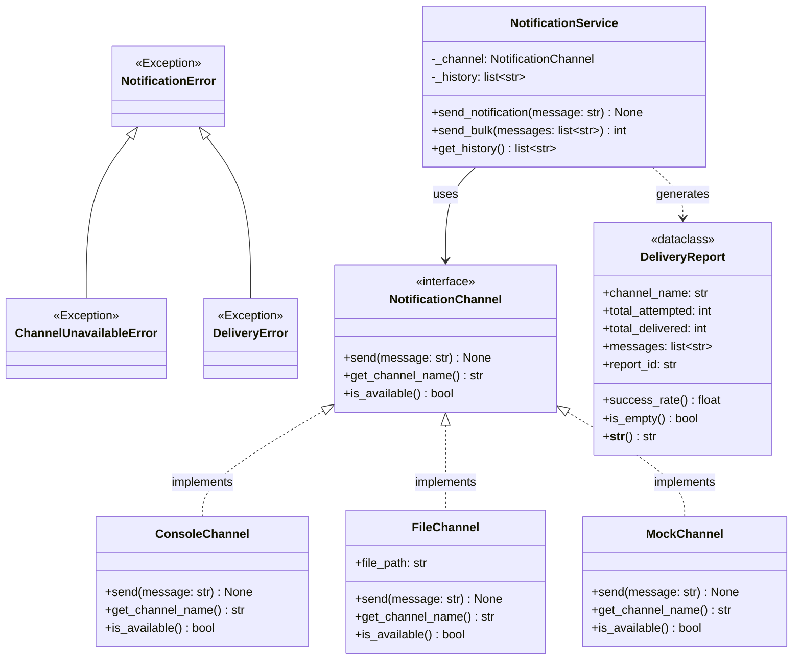

# Diagrama de Clases — Notification Service

```mermaid
classDiagram
    class NotificationChannel {
        <<interface>>
        +send(message: str) None
        +get_channel_name() str
        +is_available() bool
    }

    class NotificationError {
        <<Exception>>
    }

    class ChannelUnavailableError {
        <<Exception>>
    }

    class DeliveryError {
        <<Exception>>
    }

    class ConsoleChannel {
        +send(message: str) None
        +get_channel_name() str
        +is_available() bool
    }

    class FileChannel {
        +file_path: str
        +send(message: str) None
        +get_channel_name() str
        +is_available() bool
    }

    class MockChannel {
        +send(message: str) None
        +get_channel_name() str
        +is_available() bool
    }

    class NotificationService {
        -_channel: NotificationChannel
        -_history: list~str~
        +send_notification(message: str) None
        +send_bulk(messages: list~str~) int
        +get_history() list~str~
    }

    class DeliveryReport {
        <<dataclass>>
        +channel_name: str
        +total_attempted: int
        +total_delivered: int
        +messages: list~str~
        +report_id: str
        +success_rate() float
        +is_empty() bool
        +__str__() str
    }

    NotificationChannel <|.. ConsoleChannel : implements
    NotificationChannel <|.. FileChannel : implements
    NotificationChannel <|.. MockChannel : implements
    NotificationError <|-- ChannelUnavailableError
    NotificationError <|-- DeliveryError
    NotificationService --> NotificationChannel : uses
    NotificationService ..> DeliveryReport : generates
```
